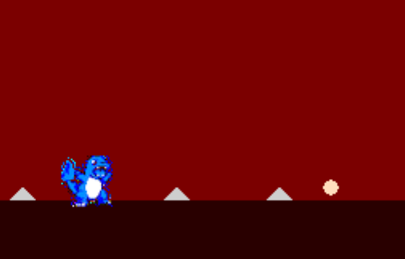

This is a side-scrolling runner inspired by [the original Dino Run game](https://en.wikipedia.org/wiki/Dino_Run).

It uses the [libnds](https://github.com/devkitPro/libnds) library to interface with peripherals in C. The game logic is primarily handled in C++.

# Setup

If you just want to play the game, skip to step 3 and use the prebuilt Dino_Run.nds binary in the root directory.

1. Install devkitpro
    - [for OSX and Linux](https://github.com/devkitPro/pacman/releases)
    - [for Windows](https://github.com/devkitPro/installer/releases/tag/v3.0.3)
2. Run make in the root dir to build the Dino_Run.nds file. It may be necessary to delete Dino_Run.arm9 and Dino_Run.elf
3. Run the .nds file on an emulator like [desmume](https://desmume.org/download/) or on an [R4 cartridge with a microSD card and physical DS](https://en.wikipedia.org/wiki/R4_cartridge)

# Gameplay

Avoid grey spikes and collect yellow points. After collecting 3 points, you will evolve to the next level to jump higher and move farther. Hitting a spike will devolve you or take away a life.

Don't worry, you can't lose this game :)

# Peripherals and features used

## Timers and Interrupts
- The physics is updated up to 60 times a second, based on the state of jumping + applied gravity
- Collisions are tested more frequently(4 times a second), obstacles and items are introduced at regular intervals (5 and 11 seconds, and 6 seconds respectively)

## Graphics and Sprites
- The background is initialized with tile mode using the main engine since it consists of solid colours
    - 2 layers: permanent background, moving collidables (update movement with a regular frequency and delete when out of frame)
- The dino sprite is used as the main character, taking up another VRAM bank
- The sub engine is used on the bottom screen fill in the blank space with the same color for consistency

- In debug mode (using the DEBUG_ON define flag in main), the bottom screen is used to view the state of the sprite

## Keypad
- Press up or A to start the game/make the sprite jump
- Press left and right to move within the bounds of the screen

## Touchscreen
- Touch the screen to restart the music

## Sound
- Game music handled with the [Maxmod library](https://maxmod.devkitpro.org/) to loop 4wtudone.it in the background
- wav sound effects for hitting spikes, evolution, and item collection

# Extensions
An additional playable character can be added by creating another instance of GameState, potentially with a different set of sprites.

# Attribution

Other Resources used:
- [Sound file library](https://modarchive.org/index.php?request=view_by_moduleid&query=61361)
- [Sprite library](https://play.pokemonshowdown.com/sprites/gen1/)
- [SFX library](https://www.wavsource.com/sfx/sfx.htm)

Interesting things I found on the way:
- [Basic Pitch (Audio to MIDI AI)](https://basicpitch.spotify.com/)